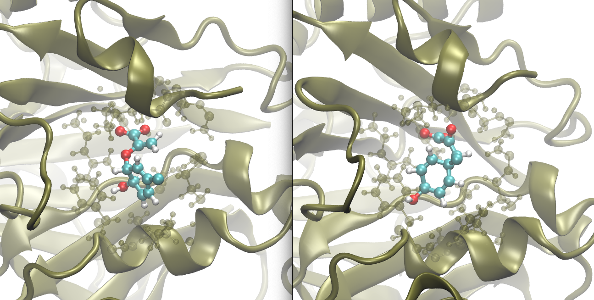

# Week 13 - QM/MM simulations

In this week, you will analyze the results of  QM/MM simulations that were run in CP2K. I have already run the simulations because they are too slow to run in class.

The source for this tutorial is [This tutorial](https://www.cp2k.org/howto:biochem_qmmm)

**Note - in some cases I gzipped the relevant files. You can unzip them with the command `gunzip`**

## Part 1 - setup
1. Read the section "Generating a topology"
2. Use vmd to open the file `Inputs/complex.prmtop` as the topology, then `Inputs/complex.inpcrd`
3. Render a nice figure of the protein in a New Cartoon representation that shows the ligands in CPK representation. You'll have to figure out how to select just the ligands, which are not protein and not water and not ions. Center the figure on one of the ligands (ideally the one below in part 3). Put this figure in the `Figures/` directory
4. Save a vmd script (e.g. `viz_topology.vmd`) in the Analysis directory so that you could recreate this image easily.

## Part 2 - equilibration
1. Read the section "Equilibration at the MM" level to see how the classical system is equilibrated
2. Create a jupyter notebook in the `Analysis` folder to analyze the energy of the various systems. Make a plot of potential energy vs time in the NVT and NPT energy files in `Outputs,` and save the result in `Figures/`

## Part 3 - standard QM/MM
1. Read the section "Moving on to QM/MM"
2. Identify which ligand is the quantum mechanical one based on the atom numbers in this section.
3. In Analysis
	- Update your energy notebook to make another plot showing the potential energy versus time for this QM/MM run, as well as the 2 that follow 
	- Add as second jupyter notebook that will monitor the reaction versus time
	- Plot the reaction coordinate for this reaction versus time. Time is in the first column and the collective variable for this reaction is found in  `Outputs/monitor/MONITOR-COLVAR.metadynLog`
	- For this plot, put time on the x axis in proper units, and on the y axis, label it with the formula for the reaction coordinate, but how do we know what that is? Read the COLVAR section of `Outputs/monitor/monitor.inp` and consult the `cp2k` manual to determine what is actually being computed. The result should make sense to you.

## Part 4 - QM/MM plus metadynamics
1. Read the section "Metadynamics"
2. In your jupyter notebook, add another line showing the value of the reaction coordinate from the simulation in `Outputs/metad1_initmonitor`. Do you see a reaction, that is, a transition from + to - or - to + values of the CV?
3. Read the `.inp` file to see the metadynamics parameters. Label your line in the plot with the value of hill height and hill width and hill frequency, so that it shows up in the caption, along with something showing that the `monitor' one is standard QM/MM
4. I ran another simulation in `Outputs/metad1_initmonitor_freqhills`. Add another line for this simulation. What did I change here? What is the result of that change in terms of the speed of sampling and how the simulation ends?
5. Make a picture of "before" and "after" the chemical reaction and a movie of the chemical reaction happening in the metadynamics simulation in `Outputs/metad1_initmonitor`, and save these three things to the images directory. 
	- You probably want to show the ligand, the protein, and the protein sidechains near the ligand. An example follows.
	- Save a vmd script for this as well, so you can recreate it as needed
	- **To see the reaction happening, you have to use dynamic bonds as the representation for the ligand!**

## Wrap up
Make sure all plots are nicely formatted and saved in images, and all analysis notebooks and vmd scripts are also included in your github.
